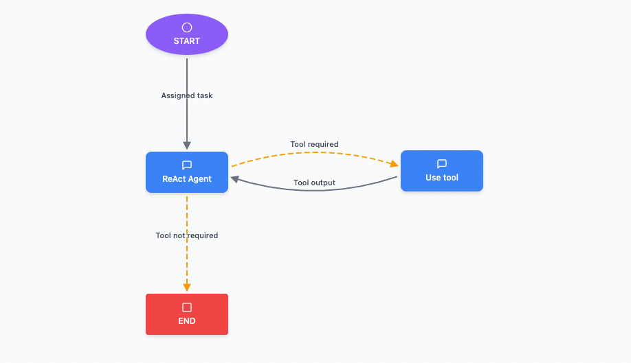

# LangGraph Flow Designer

A visual flow designer for creating and managing LangGraph workflows. This interactive tool allows you to design, edit, and export complex graph-based workflows with an intuitive drag-and-drop interface.



## Features

### Visual Graph Design
- **Drag & Drop Interface**: Create nodes by clicking buttons in the toolbar and position them anywhere on the canvas
- **Multiple Node Types**: 
  - Regular nodes for functions/operations
  - START nodes to mark entry points
  - END nodes to mark exit points  
  - Subgraph nodes for nested workflows
- **Interactive Canvas**: Pan, zoom, and navigate large workflows with ease

### Edge Management
- **Multiple Edge Types**:
  - Standard edges for direct connections
  - Conditional edges with custom conditions (shown as dashed lines)
- **Visual Feedback**: Selected edges appear in blue, conditional edges in orange
- **Edge Labels**: Add descriptive labels to document flow logic

### Tool Integration
- **Tool Library**: Create and manage reusable tools
- **Node-Tool Association**: Assign tools to specific nodes
- **Visual Indicators**: Nodes with associated tools show a green tool badge

### Properties & Customization
- **Node Properties Panel**: Edit labels, descriptions, types, and colors
- **Edge Properties Panel**: Configure edge types, labels, conditions, and styling
- **Color Customization**: Personalize node and edge colors

### Import/Export
- **JSON Export**: Save your workflows as structured JSON files
- **JSON Import**: Load previously saved workflows
- **Portable Format**: Share workflows between team members
- **Live JSON View**: Real-time JSON viewer widget shows current graph structure

## Getting Started

### Prerequisites
- Node.js (v16 or higher)
- npm or yarn

### Installation

1. Clone or download the project
2. Install dependencies:
   ```bash
   npm install
   ```

3. Start the development server:
   ```bash
   npm run dev
   ```

4. Open your browser to `http://localhost:3000`

### Building for Production

```bash
npm run build
npm run preview
```

## Usage

### Creating Your First Workflow

1. **Add Nodes**: Click any node type in the left toolbar to add it to the canvas
2. **Position Nodes**: Drag nodes to arrange your workflow layout
3. **Connect Nodes**: 
   - Select an edge type from the dropdown
   - Click "Add Edge" to enter connection mode
   - Click the source node, then the target node
4. **Configure Properties**: Click any node or edge to open the properties panel
5. **Add Tools**: Create tools in the Tool Library and assign them to nodes
6. **Export**: Click "Export" to save your workflow as JSON

### Keyboard Shortcuts
- **Delete/Backspace**: Remove selected nodes or edges
- **Escape**: Cancel connection mode and close panels

### Canvas Navigation
- **Mouse Wheel**: Zoom in/out
- **Click & Drag**: Pan the canvas
- **Zoom Controls**: Use the +/- buttons in the bottom right

### JSON Viewer
- **Toggle View**: Click the "JSON View" button in the bottom left (next to the sidebar)
- **Live Updates**: See real-time changes to your graph structure
- **Copy JSON**: One-click copy to clipboard
- **Quick Download**: Export directly from the viewer

## Architecture

### Built With
- **React 19**: Modern React with hooks for state management
- **Vite**: Fast development server and build tool
- **Tailwind CSS**: Utility-first CSS framework
- **Lucide React**: Beautiful, customizable icons

### Project Structure
```
src/
├── LangGraphFlowDesigner.jsx  # Main component
├── main.jsx                   # React entry point
└── ...
```

### Key Components
- **Canvas**: SVG-based drawing area with zoom/pan
- **Toolbar**: Node creation and edge configuration
- **Properties Panels**: Dynamic node/edge editing
- **Tool Library**: Reusable tool management

## Export Format

Workflows are exported as JSON with this structure:
```json
{
  "nodes": [
    {
      "id": "node-1",
      "type": "START", 
      "label": "Start Process",
      "x": 100,
      "y": 100,
      "tools": ["tool-1"]
    }
  ],
  "edges": [
    {
      "id": "edge-1",
      "source": "node-1",
      "target": "node-2", 
      "type": "conditional_edge",
      "condition": "user_input == 'yes'"
    }
  ],
  "tools": [
    {
      "id": "tool-1",
      "name": "API Call"
    }
  ]
}
```

## Contributing

1. Fork the repository
2. Create a feature branch
3. Make your changes
4. Test thoroughly
5. Submit a pull request

## License

MIT License - feel free to use this tool in your projects!

## Support

If you encounter issues or have feature requests, please open an issue in the project repository.